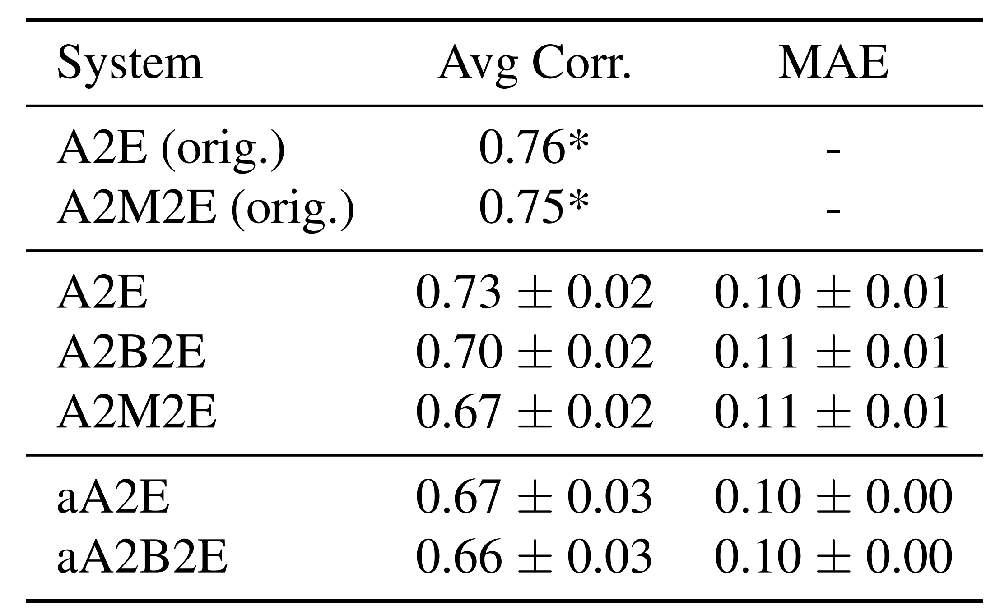
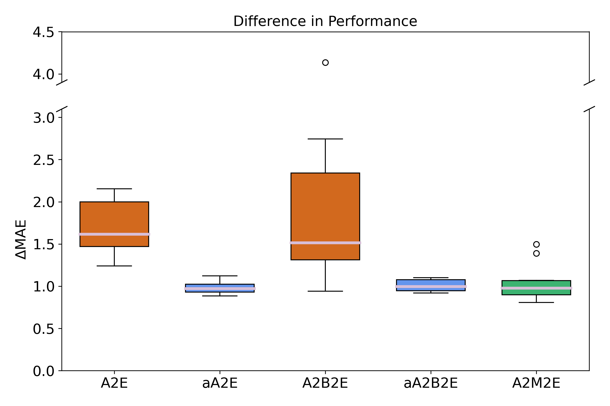
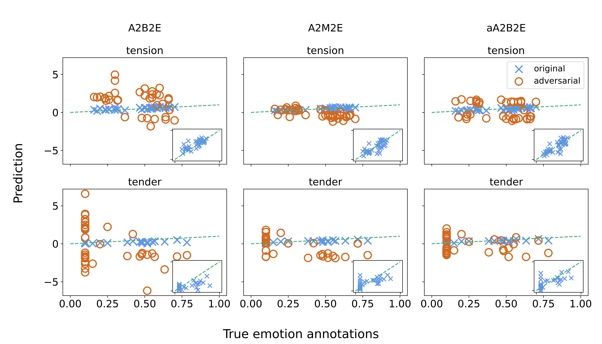

# On the Robustness of an Inherently Interpretable MER Model

This repository accompanies the publication: Katharina Hoedt, Arthur Flexer, and Gerhard Widmer, 
"Are Inherently Interpretable Models More Robust? A Study in Music Emotion Recognition", 
which will appear in the Proceedings of SMC 2025. 

This README describes how the results of this publication can be reproduced in the following steps:

* [Setup](#setup)
* [Training the Systems](#training)
* [Computing Adversaries](#adversaries)
* [Tables and Visualizations in the Paper](#tables-and-visualizations)
* [Reference Us](#cite)

Thanks also to my (former) colleagues Verena Praher and Shreyan Chowdhury,
which provided some of the code that this code is based on (particular within [`data`](data) and [`train_models`](train_models)).
Their original work, proposing the different (blackbox and interpretable) systems, 
can be found in and cited as the following publication: 

S. Chowdhury, A. Vall, V. Haunschmid, and G. Widmer, 
''Towards Explainable Music Emotion Recognition:The Route via Mid-level Features,''
in Proc. of the 20th Int. Society for Music Information Retrieval Conf., ISMIR, 2019, pp. 237–243.

The code in this repository was restructured and cleaned after submission for better readability. 
If something is not working as it should be, feel free to contact us! 

## Setup <a name="setup"></a>

The required Python libraries can be found in [requirements.txt](requirements.txt). 
You can create a `conda` environment for this project with: 

```
conda create -n py39-rmer python==3.9

conda activate py39-rmer

pip install -r requirements.txt
```

This project was tested with Python 3.9. 
Before running subsequent code, make sure to set the required paths in [`paths.py`](paths.py). 

If you only want to reproduce the results of our publication, you can now jump to [Tables and Visualizations in the Paper](#tables-and-visualizations). 
If, however, you want to experiment yourself with training your own models or computing adversarial 
examples, you also need to install `madmom`:

```
pip install -e git+https://github.com/CPJKU/madmom.git@3bc8334099feb310acfce884ebdb76a28e01670d#egg=madmom
```

which is used to (pre-)compute spectrograms on which the systems are trained on. 
Furthermore, you will have to download the used data as described in the following.

### Data

This repo builds upon two different datasets. 

1. Mid-level Features Dataset: You can get the dataset [here](https://osf.io/5aupt/). It is necessary to learn human understandable concepts. 
2. Soundtracks Dataset: This dataset is available [here](https://osf.io/p6vkg/), and is used for music emotion recognition. Make sure to also download `mean_ratings_set1.csv` for the corresponding annotations.

Note that for the mid-level features dataset, it is enough if you download [`metadata_annotations.zip`](https://osf.io/4v3xh).

## Training the Systems <a name="training"></a>

To reproduce the systems that we are using in the paper, first the data has to be preprocessed (to spectrograms),
before the systems can be trained. 

*Note that the following commands can lead to slightly different results than presented in the paper, e.g., due to the involved randomness in data-preprocessing.*


### Data Preprocessing

To precompute spectrograms which are used to train emotion recognition systems from scratch, call

```
python -m data.data_preprocessing
```

This stores the pre-processed spectrograms in `<DATA_PATH_SOUNDTRACKS>/specs`. 
If they should be stored in a different directory, use the argument `--cache_dir`.

### Train a Model

To train a single model, e.g., with the standard (non-bottleneck) architecture, you can call

```
python -m train_models.train --arch a2e --task_loss_weight 1.0 --lr 0.0005 --seed 6
```
You can modify the random seed and learning rate you want to train with accordingly with `--seed` and `--lr`. 
If you want to train the bottleneck architecture instead, use
```
python -m train_models.train --arch a2m2e --task_loss_weight 0.5 --lr 0.0005 --seed 6
```
and set `--task_loss_weight` with a factor between 0. and 1., where 1. means only the loss
on emotion labels is optimised for, and 0. means only the loss on mid-level annotations is minimised.

Finally, add the flag `--adversarial` if you want to train a system adversarially (i.e., by including adversarial examples in the training process).

### Reproduce Systems from Paper

To train all (5 x 10) models discussed in the paper, 
three different scripts are provided: 

```
sh scripts/train_blackbox.sh
```

which allows you to train all blackbox models (i.e., A2E and A2B2E);

```
sh scripts/train_adversarially.sh
```

trains the adversarially trained variants (i.e., aA2E, aA2B2E); and

```
sh scripts/train_interpretable.sh
```

trains the interpretable systems (i.e., A2M2E). 

## Computing Adversaries <a name="adversaries"></a>

To attack a model saved at `model_path`, run

```
python -m adversary.attack --exp_dir model_path --name attack_save_dir --attack_test
```

where `runs/adversaries/attack_save_dir` will be the directory where all adversaries and logs are stored.
The hyperparameters of the attack need to be set in [`attack_config.yaml`](adversary/attack_config.yaml). 
They are now set to what is used for the experiments in the paper (which was chosen via a gridsearch), 
and computed for the test data (`--attack_test`).

### Analysing adversarial examples

If you want to use the scripts in [`analysis`](analysis) to visualise the robustness results of your newly trained systems,
make sure to adapt the experiment dicts / paths to log files accordingly! 
Thereafter, you can call the scripts as described in what follows. 

## Tables and Visualizations in the Paper <a name="tables-and-visualizations"></a>

### Table 1: Performance of systems before attack



To reproduce this table, run

```
python -m analysis.compute_performance --performance_table
```

*Note that there might be slight variations compared to Table 1 due to rounding.*

### Figure 3: Differences in performance



To reproduce this figure, run

```
python -m analysis.create_paper_plots --difference
```

which creates the plot and stores it in [`plots/diff_performance.png`](plots/diff_performance.png). 

To reproduce the statistical significance tests, run

```
python -m analysis.compute_performance --statistical_test
```

### Figure 4: A closer look at some predictions



To reproduce this figure, run

```
python -m analysis.create_paper_plots --label_vs_pred
```

this creates the plot and stores it in [`plots/true_vs_pred.png`](plots/true_vs_pred.png).

## Reference Us <a name="cite"></a>

TBA after publication of Proceedings

